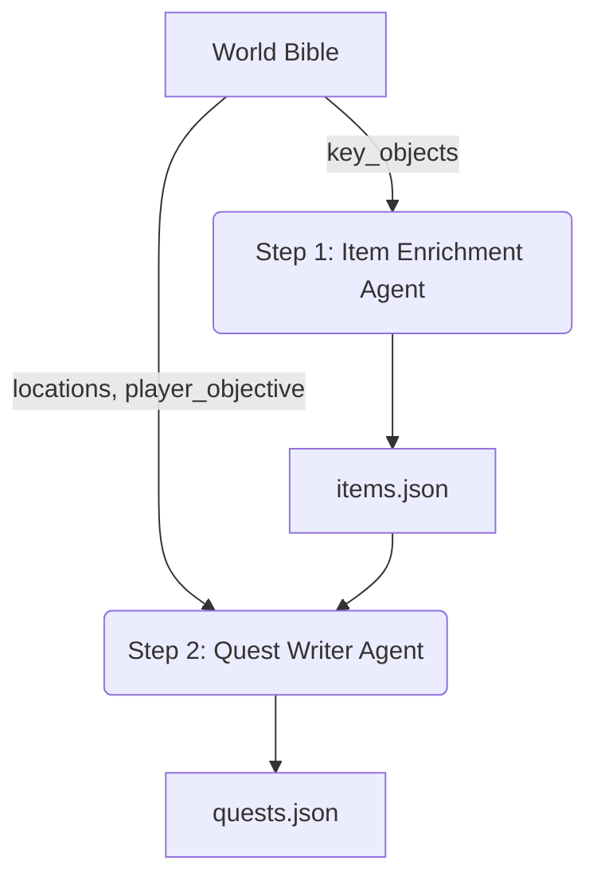

# Quest 升级迭代 03：工作流与数据结构设计 (Workflow & Schema Design)

> **版本**: 1.0
> **状态**: 规划中
> **目标**: 确立 Quest 生成的两步工作流，以及配套的数据结构升级方案。

## 1. 核心工作流设计 (Core Workflow)

为了实现从 World Bible 到 完整 Quest 网络的自动化生成，我们将流程拆分为两个独立的 AI Agent 步骤。



### 1.1 Step 1: 物品扩展 (Item Enrichment)
*   **输入**: World Bible 中的 `key_objects` (字符串列表) + World Context。
*   **Agent**: `ItemEnricher`。
*   **任务**: 将简单的物品名称扩展为具有属性、描述、获取方式的结构化数据。
*   **输出**: `items.json`。

### 1.2 Step 2: 任务生成 (Quest Generation)
*   **输入**: World Bible + NPC Roster + `items.json`。
*   **Agent**: `QuestWriter` (V2)。
*   **任务**: 利用已有的物品和地点，编织出包含对话、收集、探索等多类型节点的任务网络。
*   **输出**: `quests.json`。

---

## 2. 数据结构设计 (Schema Design)

### 2.1 物品系统 (Item System)

**文件路径**: `backend/app/schemas/item.py`

```python
class ItemObtainMethod(BaseModel):
    """物品获取方式"""
    method: Literal["dialogue", "investigate", "quest_reward", "trade", "find"]
    source: str  # NPC ID 或 地点名称
    condition: Optional[str] = None  # 前置条件描述，供 Runtime 或 玩家提示使用

class Item(BaseModel):
    id: str  # 自动生成: "item_" + sanitize(name)
    name: str
    description: str
    type: Literal["key", "clue", "tool", "consumable", "generic"]
    rarity: Literal["common", "rare", "epic", "legendary"] = "common"
    obtain_methods: List[ItemObtainMethod] = []
    usage: Optional[str] = None  # 用途说明
    stackable: bool = True
    icon: Optional[str] = None
```

### 2.2 任务系统 (Quest System)

**文件路径**: `backend/app/schemas/quest.py`

#### 2.2.1 任务条件 (QuestCondition)
```python
class QuestCondition(BaseModel):
    """任务节点的完成条件"""
    type: Literal["affinity", "item", "location", "time", "dialogue"]
    operator: Literal["AND", "OR"] = "AND"
    params: Dict[str, Any] = Field(default_factory=dict)
    
    # 示例参数:
    # item: {"item_id": "item_key", "count": 1}
    # location: {"location": "地下室"}
    # dialogue: {"npc_id": "npc_01", "keywords": ["线索"]}
```

#### 2.2.2 任务节点 (QuestNode)
```python
class QuestNode(BaseModel):
    id: str
    node_type: Literal["dialogue", "collect", "investigate", "wait", "choice"]
    description: str
    
    conditions: List[QuestCondition] = []
    
    # 奖励配置
    rewards: Optional[Dict[str, Any]] = None # {"items": ["item_gold"], "affinity": {"npc_01": 2}}
    completion_hint: Optional[str] = None # 提示文本
    
    # 兼容字段
    target_npc_id: Optional[str] = None 
    
    status: Literal["locked", "active", "completed", "failed"] = "locked"
```

#### 2.2.3 任务网络 (Quest)
```python
class Quest(BaseModel):
    id: str
    title: str
    type: Literal["main", "side"] = "side"
    description: str
    nodes: List[QuestNode] = []
    
    # 状态管理
    active_nodes: List[str] = [] # 当前激活的节点ID列表 (支持并行)
    status: Literal["locked", "active", "completed", "failed"] = "active"
```

---

## 3. 产出物规范 (Deliverables)

每个世界生成后，将在 `data/worlds/{world_id}/` 下包含：

### 3.1 items.json
包含 10-15 个结构化物品。
```json
{
  "items": [
    {
      "id": "item_mysterious_key",
      "name": "神秘的钥匙",
      "type": "key",
      "obtain_methods": [{"method": "dialogue", "source": "npc_bartender"}]
    }
  ]
}
```

### 3.2 quests.json
包含 3-4 个任务，每个任务 3-5 个节点。
```json
{
  "quests": [
    {
      "id": "mq_01",
      "nodes": [
        {
          "id": "n1",
          "node_type": "collect",
          "conditions": [{"type": "item", "params": {"item_id": "item_mysterious_key"}}]
        }
      ]
    }
  ]
}
```

---

## 4. 实施计划 (Implementation Plan)

### Phase 1: Schema 扩展 (1天)
- [ ] 创建 `backend/app/schemas/item.py`。
- [ ] 更新 `backend/app/schemas/quest.py`。
- [ ] 确保代码编译通过且向后兼容。

### Phase 2: 工作流实现 (2天)
- [ ] 实现 `ItemEnricher` (Prompt + Service)。
- [ ] 升级 `QuestWriter` (Prompt V2)。
- [ ] 重构 `QuestGenerator` 串联两步流程。
- [ ] 实现文件保存逻辑。

### Phase 3: 测试验证 (0.5天)
- [ ] 创建测试世界。
- [ ] 检查生成的 JSON 文件结构和逻辑关联性。
