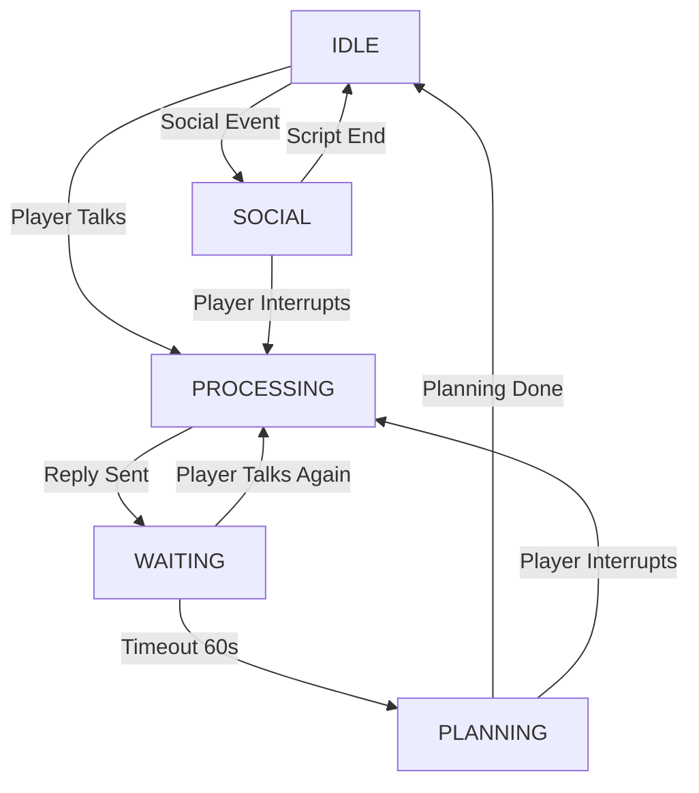

# 交互状态机与动态日程系统设计 (Interaction State Machine & Dynamic Scheduling)

## 1. 核心目标
解决玩家与 NPC 互动时的并发冲突、日程逻辑中断以及动态规划问题。

### 主要痛点
1.  **并发冲突 (Race Condition)**: 玩家与 NPC 对话期间，NPC 可能会被 `SocialEngine` 拉走去聊天或执行日程移动，导致“人还在回复玩家，身体已经走了”的时空错乱。
2.  **日程僵化**: NPC 无法根据玩家的对话内容（如约好稍后见）实时调整后续日程。
3.  **时机不当**: 如果在回复生成的瞬间就修改日程，可能会因为玩家后续的追问而频繁触发修改，不符合真实人类“对话结束后再思考”的行为模式。

## 2. 状态机模型 (State Machine)

为了精确控制 NPC 的行为，我们引入以下状态流转。

### 状态定义
在 `RuntimeEngine.npc_states[npc_id]` 中增加 `interaction_state` 字段：

| 状态 | 描述 | Is Busy? | 触发条件 | 结束条件 |
| :--- | :--- | :--- | :--- | :--- |
| **IDLE** | 正常生活，执行日程 | `False` | 默认状态 | 收到玩家消息 |
| **PROCESSING** | 正在思考如何回复玩家 | `True` (强锁) | 收到玩家消息 | LLM 返回回复 |
| **WAITING** | 回复完毕，等待玩家追问 | `True` (软锁) | 回复发送完毕 | 玩家追问 (-> PROC) 或 超时 (-> PLAN) |
| **PLANNING** | 对话结束，思考是否调整日程 | `True` (强锁) | WAITING 超时 (60s) | 规划完成 |
| **SOCIAL** | 正在与其他 NPC 互动 | `True` (强锁) | Social Engine 触发 | 剧本结束 或 被玩家打断 |

### 状态流转图


### 关键约束
- **全局忙碌锁 (`is_busy`)**: 只要状态不为 `IDLE`，`is_busy` 必须为 `True`。
- **日程挂起**: `RuntimeEngine.on_tick` 会跳过所有 `is_busy=True` 的 NPC，确保在互动期间 NPC 绝对静止，不会执行任何日程移动或社交。

## 3. 模块职责

### A. RuntimeEngine (`runtime.py`)
- **状态维护**: 在 `npc_states` 中存储 `interaction_state` 和 `last_interaction_time`。
- **心跳检查 (`on_tick`)**:
    - 遍历所有处于 `WAITING` 状态的 NPC。
    - 检查 `datetime.now() - last_interaction_time > 60s` (使用真实时间)。
    - 如果超时，触发 `DirectorEngine.plan_post_interaction(npc)`，并将状态切为 `PLANNING`。

### B. PlayerEngine (`player_engine.py`)
- **入口**: 接收玩家输入。
- **打断逻辑**:
    - 无论当前处于 `IDLE`, `WAITING` 甚至 `PLANNING`，一旦收到玩家输入，立即强制切回 `PROCESSING`。
    - 如果正在 `PLANNING`，取消当前的规划任务。
- **回复处理**:
    - 调用 LLM 生成回复（保持现有的 `Reaction` 逻辑）。
    - 回复发送后，将状态设为 `WAITING`，更新 `last_interaction_time` 为当前时刻。

### C. DirectorEngine (`director_engine.py`)
- **新增功能**: `plan_post_interaction(npc)`
- **逻辑**:
    - 调用 LLM，传入刚才的对话摘要和接下来的日程。
    - 询问：“基于这段对话，是否需要修改后续日程？”
    - 如果 LLM 返回修改指令，调用 `runtime.update_npc_schedule`。
    - 任务完成后，将 NPC 状态重置为 `IDLE`（解除忙碌锁）。

### D. SocialEngine (`social_engine.py`) - 新增集成
- **任务追踪**: 启动 Social 任务时，将 Task 对象存入参与者（如 A 和 B）的 `npc_states[npc_id]['social_task']`。
- **状态管理**: 参与 Social 的 NPC 状态设为 `SOCIAL` (is_busy=True)。
- **日程修改**:
    - 在 `SOCIAL_SYSTEM_PROMPT` 中增加 `outcome_schedules` 字段。
    - 剧本播放完毕后，解析该字段并直接更新 A 和 B 的日程。
- **被动打断**:
    - 如果 `PlayerEngine` 强行取消了 `social_task`，捕获 `CancelledError`。
    - 停止播放后续剧本。
    - 将未被玩家互动的另一方 NPC（如 B）重置为 `IDLE`。

## 4. 数据结构变更

### NPC State (`runtime.py`)
```python
self.npc_states[npc_id] = {
    'is_busy': bool,
    'busy_until': datetime, # 游戏时间锁 (用于 Action)
    'interaction_state': 'IDLE' | 'PROCESSING' | 'WAITING' | 'PLANNING',
    'last_interaction_time': datetime, # 真实时间 (用于 Timeout)
    'planning_task': asyncio.Task, # 用于打断 Post-Planning
    'social_task': asyncio.Task # 用于打断 Social Script
}
```

## 5. 预期效果
1.  **绝对稳定**: 只要玩家在跟 NPC 说话，NPC 就绝对不会乱跑。
2.  **自然反应**: 玩家说完话后，NPC 会等一会儿（60秒）。如果玩家没话说了，NPC 才会开始思考“刚才他说的事我要不要去办”，然后调整日程，转身离开。
3.  **随时打断**: 即使 NPC 正在思考日程，玩家一句“等一下”，NPC 也会立刻回过神来继续对话。
